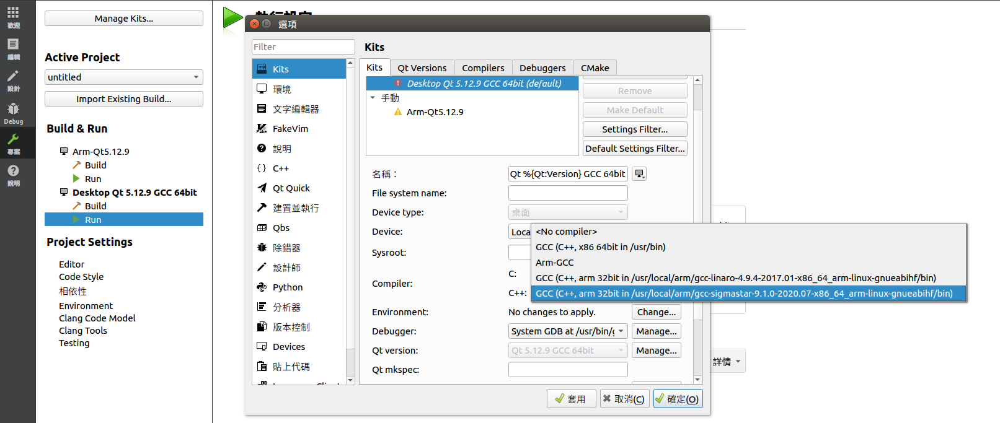
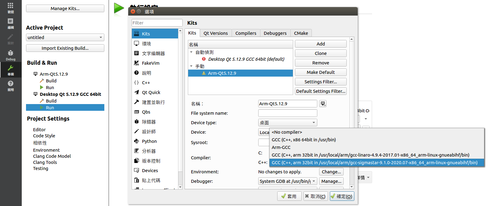

# Note #
before run/build ...
1. check kits, must be "C++, arm 32 bit, ..., gcc-sigmastar...."

2. install libusb-1.0-0-dev

3. update glibc (if version < 2.28) (https://uni.workxplay.net/t/topic/247)
   - use `ldd --version` to checkout glibc version 

## Version 1 ##
build success \
add a label - "Test 2024/12/09"

## Version 1.1 ##
fix tick_flag

## Version 2 ##
加入了"新增病例"，"瀏覽病例"以及"查看完整病例"
#### 待完成 : ####
- 新增病例 : 
  1. 點擊"check"，開始檢查
  2. 新增圖片時，選擇該名病患的資料夾而不是預設資料夾
  3. 限制特定輸入欄的輸入格式
  4. 離開"新增病例"時，將"新增病例"初始化
  
- 瀏覽病例 :
  1. 搜尋病例
 
- 查看完整病例 :
  1. 編輯病例
  2. 當圖片數量小於3張時，graphview的排版
 
- 由於要為每位病患新增屬於該名病患的資料夾，因此整體架構或是流程需做更改

## Version 3 ##
- 病歷號大致已完成，剩搜尋病例
#### 一些小問題 :
- USB和SD在資料庫存取上是否會出問題?
- 瀏覽病例時是否要改為翻頁式而非滾動式?
- 新增病例照片時，是否要限制新增的張數?
  - 如果不要，那瀏覽完整報告時，是否要限制其顯示的張數?

## Version 4 ##
- 加入搜尋病例的功能
- 修復了當刪除report後再新增report時OID會不正確的問題
- 格式化時也會同時將資料庫清空
- 當預覽病例時，無法編輯履歷
- 當編輯病例時，按下檢查就會保存並新增病例
- 加入病歷號的翻譯
- no SD卡時的提示翻譯
- 修復搜尋時的一些bug

## Version 5 ##
- 將SD_CARD和USB_FLASH的資料庫分開
- 當隨身碟插入和拔出時，切換資料庫
- 改善資料庫插入、刪除和更改資料的方法
- 修復加入第一筆資料的OID不正確的問題
- 在顯示"無法連接資料庫"的頁面增加"返回"按鈕
- 在"瀏覽完整報告"中加入"描述"一欄

## Version 6 ##
- 修正當開始檢查時，點擊"瀏覽病例" -> "完整報告" -> "編輯" -> "檢查" -> "瀏覽病例"，會多出一個default的bug
- 在"開始檢查"的頁面顯示當前選擇病患的名字
- 新增當開始檢查時，點擊"瀏覽病例"，若未選擇病例則照常顯示選擇病例的畫面，反之則顯示編輯病例的畫面，並在編輯畫面新增一個"重新選擇"的按鈕
- 出生年月的格式錯誤從原先的用MessageBox來提示，變成用QWidget來顯示([errorformat.cpp](./errorformat.cpp))
- 加入官方的虛擬鍵盤

虛擬鍵盤的使用須知請見：[QtVirtualKeyboard](./VirtualKeyboard.md)

## Version 6.1 
- 修正.jpg檔無法正常顯示：
  1. 檢查VM中的libQt5Gui.so.5：nm -D /path/to/libQt5Gui.so.5 | grep qt_convert_rgb888_to_rgb32_neon，出來結果應該要像"00316331 T _Z31qt_convert_rgb888_to_rgb32_neonPjPKhi"，若不是可能就要重新build ARM的編譯環境，詳情請見 [QtVirtualKeyboard](./VirtualKeyboard.md) 中的 前置準備(ARM)。
  2. 將VM中的libQt5Gui.so.5取代機器中的libQt5Gui.so.5。
  3. 這樣應該就可以解決，如果還是沒有，到設定QT路徑的.sh檔中，加入"export QT_DEBUG_PLUGINS=1"，之後再重開機器，檢查是哪個地方出問題。
- 修正Confirm_folder_usbflash沒有被呼叫的問題
- 修正widget.cpp無法正常build的問題

## Version 7
- 修正addReport和fullReport中，QGraphicsScene的場景大小不會因為照片減少而減少的問題
- 修正當在addReport點擊"檢查"後，不會選擇該病例的問題
- VKeyboard內僅變更變數名稱
- 更新src內的檔案

## Version 7.1
- 使虛擬鍵盤只有簡體中文和英文兩中輸入法可選

## Version 8
- 將新UI和我目前寫好的UI融合，使其可以配合新機器
- 修正當拔出(或開機時沒有)SD卡或隨身碟時，無法瀏覽病歷號的bug

## Version 8.1
- 修正選取照片在fullreport的顯示bug
- 修正fullreport的"edit"按鈕在特定情況下無法點擊的bug
- 將燒錄完首次開機的預設語言更改為簡中

## Version 8.2
- 將主機前面的燈泡關閉

## Version 8.3
- 修正虛擬鍵盤破圖的bug
- 將版本號更改為我們自定義的版本號

## Version 9
- addReport移除各欄位的預設值
- 當按住scrollBar滑動頁面時，移除scrollBar會變成紅色的stylesheet
- 新增電池 :
  - 偵測電量
  - 偵測充電狀態

## Version 9.1
- 新增"確認刪除"
- 更新翻譯

## Version 9.2
- 修正電池ADC值

## Version 9.3
- 修正電池ADC值
- 更新版號
- 變更browseReport裡"新增病例"以及"返回"這兩個按鈕的StyleSheet

## Version 9.4
- 移除判斷電池ADC最大值的上限

## Version 10
- 修正在特殊情況下，"添加照片"按鈕無法使用的問題
- 保存病例時不再跳轉頁面，顯示"保存成功"
- 修正在"瀏覽病例"的頁面使用虛擬鍵盤時，虛擬鍵盤的選字區域無法正常顯示的bug
- 修改pickphoto的stylesheet
- 修改插拔USB或SD卡後，病例選擇的問題

## Version 10.1
- 修改鍵盤無法正常顯示的問題
- 在"設置時間"時，改變要修改欄位的文字顏色

## Version 10.2
- 修正儲存裝置資料不同步的問題

## Version 11
- 新增低電量時，顯示"請充電"的提示

## Version 11.1
- 變更檔名 :
  - QT預設檔名是全小寫，但.ui檔會根據class名稱來include .h檔，若class名稱和檔名只有大小寫不同，Window不會出現問題，但Linux就會出現找不到檔案的問題，進而無法編譯。
    - 例如 : 有個class名稱是addReport，若在創建時沒更改檔名而是沿用QT預設的檔名，那class addReport的檔名就會是addreport.h，但.ui檔在include時是include <addReport.h> \
    而不是include <addreport.h>，Windows會把addreport.h和addReport.h視為同一份檔案但Linux不會。
  - 這次的情況是，以上面的例子來說明 : \
  所有檔案都放在VM的share folder裡，當編譯.ui檔時，因為share folder的所在位置的作業系統是Windows，所以會把addReport.h和addreport.h視為同一份檔案，因此可以順利編譯。 \
  但若不是放在share folder裡而是放在VM裡的話(Linux環境)，當編譯.ui檔時，就會因為找不到addReport.h而無法編譯。

## Version 11.2
- 修正當開機無手柄時，仍然可以進入control_interface的問題
- 移除src/qml裡不需要的檔案，新增libQt5Gui.so.5到src/裡

## Version 11.3
- 修正雙手柄時，在雙畫面的模式下，背景圖片異常的問題

## Version 12
- 修正影片刪除後死機的問題
- 新增影片重播功能
- (尚未)修正拍照後死機的問題

## Version 12.1
- 隱藏部分未使用到的功能

## Version 12.2
- 新增手柄插入後，自動跳轉到"開始檢查"的畫面

## Version 12.3
- 修復 Version 11.1 中遺漏沒修復到的地方